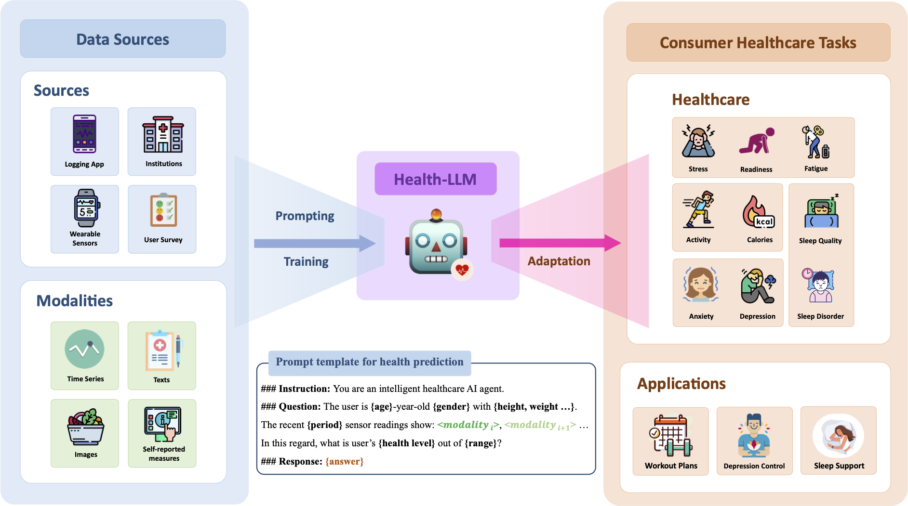

### Health-LLM: Large Language Models for Health Prediction via Wearable Sensor Data (2024)

Large language models (LLMs) are capable of many natural language tasks, yet they are far from perfect. In health applications, grounding and interpreting domain-specific and non-linguistic data is important. This paper investigates the capacity of LLMs to make inferences about health based on contextual information (e.g. user demographics, health knowledge) and physiological data (e.g. resting heart rate, sleep minutes). We present a comprehensive evaluation of 10 publicly accessible state-of-the-art LLMs with prompting and fine-tuning techniques on four public health datasets (PMData, LifeSnaps, GLOBEM and AW\_FB). Our experiments cover 10 consumer health prediction tasks in mental health, activity, metabolic, and sleep assessment. Our fine-tuned model, HealthAlpaca exhibits comparable performance to much larger models (GPT-3.5, GPT-4 and Gemini-Pro), achieving the best or second best performance in 6 out of 10 tasks. Ablation studies highlight the effectiveness of context enhancement strategies. Notably, we observe that our context enhancement can yield up to 23.8\% improvement in performance. While constructing contextually rich prompts (combining user context, health knowledge and temporal information) exhibits synergistic improvement, the inclusion of health knowledge context in prompts significantly enhances overall performance.

